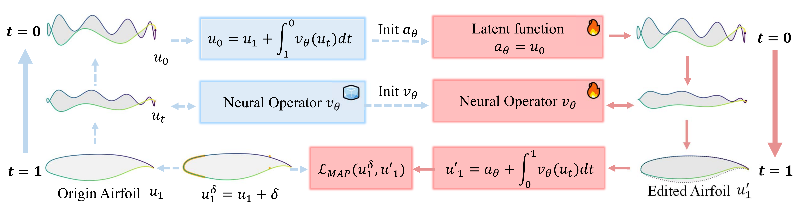

# FuncGenFoil: Airfoil Generation and Editing Model in Function Space
    
[](https://arxiv.org/abs/2502.10712)
[](https://opensource.org/licenses/Apache-2.0)

English | [简体中文(Simplified Chinese)](https://github.com/zjowowen/FuncGenFoil/blob/main/README.zh.md)

**FuncGenFoil**, short for Function-Space Generated Airfoil, is a method for generating airfoils using generative models in function space, such as diffusion models or flow models. This library provides a framework to demonstrate the power of generative models in design and optimization.


## Outline

- [FuncGenFoil: Airfoil Generation and Editing Model in Function Space](#funcgenfoil-airfoil-generation-and-editing-model-in-function-space)
  - [Outline](#outline)
  - [Framework](#framework)
  - [Installation](#installation)
  - [Quick Start](#quick-start)
  - [Citation](#citation)
  - [License](#license)

## Framework

Demonstration of airfoil generation model training and inference in function space.
<p align="center">
  
</p>

Demonstration of airfoil editing model training and inference in function space.
<p align="center">
  
</p>

## Installation

Please install from source:

```bash
git clone https://github.com/zjowowen/FuncGenFoil.git
cd FuncGenFoil
pip install -e .
```

## Quick Start

Here is an example of how to train a airfoil generative flow model in function space.

Download dataset from [here](https://drive.google.com/drive/folders/1LU6p-TeWpH5b1Vvh2GRv_TwetHkyV8jZ?usp=sharing) and save it in the current directory.

To train the model without conditional information:
```bash
python examples/train_unconditional_airfoil_generation.py
```

To train the model with conditional information:
```bash
python examples/train_conditional_airfoil_generation.py
```

To train the model for airfoil editing:
```bash
python examples/train_airfoil_editing.py
```

To evaluate the model for airfoil generation with super-resolution:
```bash
python examples/eval_airfoil_generation_super_resolution.py
```

To evaluate airfoil generation and editing using Gradio:
```bash
pip install gradio
python app.py
```

## Citation

If you find this work useful, please consider citing:

```latex
@misc{zhang2025funcgenfoilairfoilgenerationediting,
      title={FuncGenFoil: Airfoil Generation and Editing Model in Function Space}, 
      author={Jinouwen Zhang and Junjie Ren and Aobo Yang and Yan Lu and Lu Chen and Hairun Xie and Jing Wang and Miao Zhang and Wanli Ouyang and Shixiang Tang},
      year={2025},
      eprint={2502.10712},
      archivePrefix={arXiv},
      primaryClass={cs.LG},
      url={https://arxiv.org/abs/2502.10712}, 
}
```

## License

FuncGenFoil is licensed under the Apache License 2.0. See [LICENSE](LICENSE) for more details.
