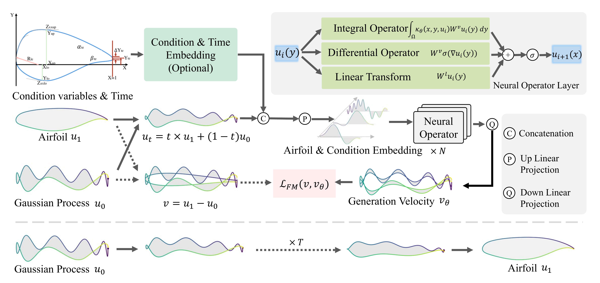
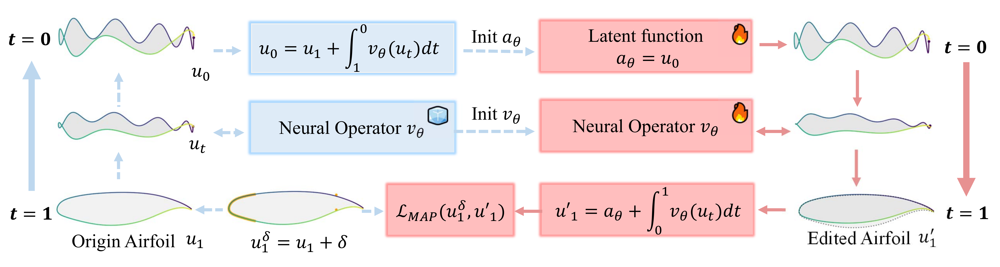

# 在函数空间中生成和编辑翼型

[](https://arxiv.org/abs/2502.10712)
[](https://opensource.org/licenses/Apache-2.0)

[英语 (English)](https://github.com/zjowowen/FuncGenFoil/blob/main/README.md) | 简体中文

**FuncGenFoil** 是一个在函数空间中使用生成模型生成翼型的方法，例如扩散模型或流模型。这个库提供了一个框架，用于展示生成模型在设计和优化中的强大功能。


## 大纲

- [框架](#框架)
- [安装](#安装)
- [快速开始](#快速开始)
- [开源协议](#开源协议)

## 框架结构

在函数空间中训练和推理翼型生成模型的演示。
<p align="center">
  
</p>

在函数空间中训练和推理翼型编辑模型的演示。
<p align="center">
  
</p>

## 安装

请从源码安装：

```bash
git clone https://github.com/zjowowen/FuncGenFoil.git
cd FuncGenFoil
pip install -e .
```

## 快速开始

以下是如何在函数空间中训练一个翼型生成流模型的示例。

从[这里](https://drive.google.com/drive/folders/1LU6p-TeWpH5b1Vvh2GRv_TwetHkyV8jZ?usp=sharing)下载数据集并将其保存在当前目录。

训练不带条件信息的模型：
```bash
python train_unconditional_airfoil_generation.py
```

训练带条件信息的模型：
```bash
python train_conditional_airfoil_generation.py
```

训练用于翼型编辑的模型：
```bash
python train_airfoil_editing.py
```

评估用于翼型生成模型在超分辨率下的表现：
```bash
python eval_airfoil_generation_super_resolution.py
```

## 开源协议

FuncGenFoil 开源协议为 Apache License 2.0。更多信息和文档，请参考 [开源协议](LICENSE)。
